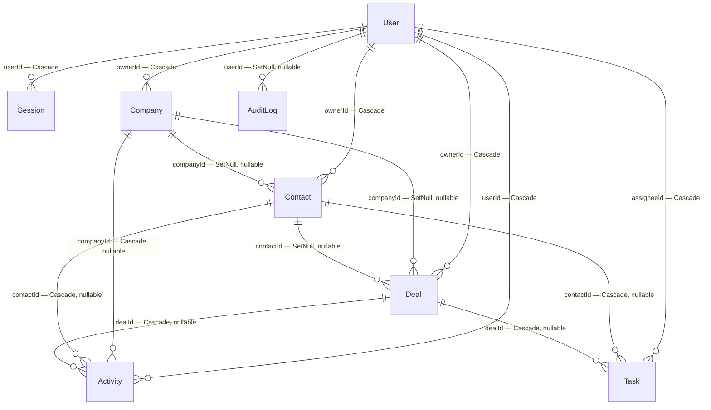

# Data Model

How Nexus CRM stores its data, why each column and each delete rule is the way it is, and
where the model is honestly weak. Everything here is drawn from
[`prisma/schema.prisma`](../prisma/schema.prisma), the two migrations under
[`prisma/migrations/`](../prisma/migrations), and the code that actually queries the tables in
`src/app/(app)/**` and `src/server/actions/**`.

If you only read one section, read [Ownership is authorization, not
scoping](#ownership-is-authorization-not-scoping) and [The enum-like string
columns](#the-enum-like-string-columns). Those two facts explain most of what looks surprising
elsewhere.

---

## The shape of the system

Eight tables. One shared workspace. Every CRM row hangs off a `User` through an ownership
column (`ownerId`, `assigneeId`, or `userId`), and there is **no `Workspace` model** — this is
single-tenant by design. A second registered user does not get a private space; they get the
same records everybody else sees.

The database is SQLite in both environments: a local file via `better-sqlite3` in development
and Docker, and Turso (libSQL) in production. The switch is
[`src/lib/db-adapter.ts`](../src/lib/db-adapter.ts) — one Prisma schema, two drivers, because
both speak the same dialect. That is the reason the schema has no `enum` blocks anywhere: SQLite
does not have them, and the schema's own header comment says so.

The datasource block carries no `url`. Prisma 7 driver adapters supply the runtime connection,
and [`prisma.config.ts`](../prisma.config.ts) feeds `DATABASE_URL` to the CLI for
`prisma migrate dev` and `prisma generate`. The generated client lands in `src/generated/prisma`,
which is git-ignored and rebuilt by the `postinstall` hook.

### Entity relationships and delete behaviour



Read the labels as: *column on the child — what happens to the child when the parent is deleted*.

---

## Ownership is authorization, not scoping

This is the single most misread thing in the schema. `Company`, `Contact` and `Deal` all carry a
required `ownerId`; `Task` carries `assigneeId`; `Activity` carries `userId`. It looks like
per-user data partitioning. It is not.

**No list query filters on the ownership column.** `prisma.contact.findMany` in
`src/app/(app)/contacts/page.tsx:35` filters on status and search text only.
`src/app/(app)/companies/page.tsx:47` filters on size and search text only.
`src/app/(app)/deals/page.tsx:13` filters on nothing at all. The dashboard's pipeline numbers
(`src/app/(app)/dashboard/page.tsx:46`) count every deal in the table regardless of owner. The
only query anywhere that filters by the current user is the dashboard's task list
(`where: { assigneeId: user.id, done: false }`), and that is a personal to-do widget, not a
tenancy boundary.

What ownership *does* control is mutation. `canMutate(ownerId, user)` in
[`src/lib/authz.ts`](../src/lib/authz.ts) returns true when the caller owns the row **or** is an
ADMIN, and every update and delete action calls it. Until recently only the delete paths did —
the four update actions had no check at all, so a MEMBER could rewrite any record but not delete
one. Overwriting every field is as destructive as the delete that was blocked, which is why the
predicate now lives in one shared file rather than being copy-pasted per action.

So: everyone reads everything; only owners and admins write. Describe it that way in an
interview. Calling it multi-tenant would be wrong, and a reviewer who greps for `ownerId` in the
page queries will notice.

---

## Models, field by field

Types are given as the Prisma type followed by the SQLite column type from
`prisma/migrations/20260715164036_init/migration.sql`.

### User

The account. Also the ADMIN/MEMBER role holder.

| Field | Type | Null | Default | Meaning |
| --- | --- | --- | --- | --- |
| `id` | `String` / TEXT PK | no | `cuid()` (client-side) | Prisma generates the cuid; there is no DB-side default |
| `email` | `String` / TEXT | no | — | **UNIQUE.** Lower-cased by `registerSchema`/`loginSchema` (`z.email().toLowerCase()`) before it ever reaches the table, so the uniqueness constraint is effectively case-insensitive |
| `name` | `String` / TEXT | no | — | Display name; 2–100 chars at the form boundary |
| `passwordHash` | `String` / TEXT | no | — | bcrypt, cost 12. Stripped from the object `getCurrentUser()` returns (`src/lib/auth/session.ts:79`) so it cannot be serialized to a client component |
| `role` | `String` / TEXT | no | `'MEMBER'` | `ADMIN` or `MEMBER`. Never user-supplied — see below |
| `createdAt` | `DateTime` / DATETIME | no | `CURRENT_TIMESTAMP` | |
| `updatedAt` | `DateTime` / DATETIME | no | none in SQL | `@updatedAt` — Prisma writes it on every update. The column is `NOT NULL` with **no** SQL default, so a hand-written `INSERT` that omits it fails. Every writer here goes through Prisma, so this only bites if you reach for raw SQL |

`role` is the one enum-like column no form can set. `register()` computes it —
`role: userCount === 0 ? "ADMIN" : "MEMBER"` (`src/lib/auth/actions.ts:67`), so the first account
to register becomes the workspace admin — and the seed pins the demo account to ADMIN via upsert.
Because `canMutate` tests `user.role === "ADMIN"` and nothing else, any unexpected value degrades
safely to member-level permissions.

Registration is open, which is why `src/app/(app)/settings/page.tsx:50` gates the email column of
the team roster to admins and the viewer's own row. Names and roles stay visible as team context;
addresses are PII.

### Session

Server-side session records. There is no JWT anywhere in this codebase.

| Field | Type | Null | Default | Meaning |
| --- | --- | --- | --- | --- |
| `id` | `String` / TEXT PK | no | `cuid()` | |
| `tokenHash` | `String` / TEXT | no | — | **UNIQUE.** SHA-256 hex of the cookie token. The raw token exists only in the `nexus_session` cookie and in memory during a request |
| `userId` | `String` / TEXT | no | — | FK → `User.id`, `onDelete: Cascade` |
| `expiresAt` | `DateTime` / DATETIME | no | — | 30 days out at creation |
| `createdAt` | `DateTime` / DATETIME | no | `CURRENT_TIMESTAMP` | |
| `userAgent` | `String?` / TEXT | yes | — | Truncated to 255 chars in code (`session.ts:32`); the column itself has no length limit |

Storing the hash rather than the token is the point: a database dump — or a leaked backup — does
not hand the attacker usable cookies. It also means a token can only ever be looked up by exact
hash, so `tokenHash` being UNIQUE is both a correctness constraint and the index that every
authenticated request uses.

Lifecycle, all in [`src/lib/auth/session.ts`](../src/lib/auth/session.ts):

1. **Create** — `login`/`register` call `createSession()`, which writes the row and sets an
   `httpOnly`, `SameSite=Lax`, `secure`-in-production cookie whose expiry matches `expiresAt`.
2. **Validate** — `getCurrentUser()` hashes the cookie, does one `findUnique` on `tokenHash`, and
   is wrapped in React's `cache()` so a layout, a page and three server actions in the same
   request share a single query.
3. **Sliding renewal (intended, but broken)** — if fewer than 15 days remain, `expiresAt` is
   pushed back out to 30 days. This has no user-visible effect: only the database row is
   updated, never the cookie, so the browser still discards it 30 days after sign-in. The
   effective policy is a fixed 30-day absolute expiry, and the extended row becomes unreachable
   garbage that the lazy expiry path in step 4 can no longer collect. Known unfixed bug.
4. **Expire** — an expired row is deleted lazily, the first time somebody presents that exact
   cookie again.
5. **Destroy** — `logout` deletes by `tokenHash` and clears the cookie.

There is **no bulk sweep of expired sessions**. If a user logs in from a laptop they never touch
again, that row sits in the table forever, because nothing will ever present its token to trigger
the lazy delete. See [Volume and growth](#volume-and-growth).

### Company

| Field | Type | Null | Default | Meaning |
| --- | --- | --- | --- | --- |
| `id` | `String` / TEXT PK | no | `cuid()` | |
| `name` | `String` / TEXT | no | — | Required, ≤160 chars at the form |
| `domain` | `String?` / TEXT | yes | — | Free text, ≤160. **Not unique** — two rows may share a domain |
| `industry` | `String?` / TEXT | yes | — | Free text, ≤120. No controlled vocabulary |
| `size` | `String?` / TEXT | yes | — | One of `1-10`, `11-50`, `51-200`, `201-1000`, `1000+`. Enum-like, zod-only |
| `website` | `String?` / TEXT | yes | — | Validated as a URL that starts with `http` (`companySchema`), so the company detail page can render it as an anchor without a scheme-injection risk |
| `notes` | `String?` / TEXT | yes | — | ≤5000 at the form; no DB limit |
| `ownerId` | `String` / TEXT | no | — | FK → `User.id`, Cascade |
| `createdAt` / `updatedAt` | DATETIME | no | `CURRENT_TIMESTAMP` / — | `updatedAt` drives the default sort on the companies list |

### Contact

The busiest model: it is the only one the AI layer writes to.

| Field | Type | Null | Default | Meaning |
| --- | --- | --- | --- | --- |
| `id` | `String` / TEXT PK | no | `cuid()` | |
| `firstName` | `String` / TEXT | no | — | ≤80 |
| `lastName` | `String` / TEXT | no | — | ≤80. Split first/last rather than one `name` because `initials()` and `fullName()` in `src/lib/utils.ts` both need the parts, and avatars are generated from them |
| `email` | `String?` / TEXT | yes | — | Optional; validated as an email when present. **Not unique** — nothing stops two contacts sharing an address |
| `phone` | `String?` / TEXT | yes | — | Free text ≤40; deliberately not normalised, because the seed carries `+46 8 555 0110` style international numbers |
| `title` | `String?` / TEXT | yes | — | Job title, ≤120. Fed to the AI lead scorer as a seniority signal |
| `status` | `String` / TEXT | no | `'LEAD'` | `LEAD` / `QUALIFIED` / `CUSTOMER` / `CHURNED`. Enum-like, zod-only |
| `source` | `String?` / TEXT | yes | — | `website` / `referral` / `outbound` / `event` / `other`. Enum-like, zod-only |
| `notes` | `String?` / TEXT | yes | — | ≤5000. Also fed to the AI as fit signal |
| `aiScore` | `Int?` / INTEGER | yes | — | 0–100. Null until somebody clicks Score |
| `aiScoreReason` | `String?` / TEXT | yes | — | One sentence. Sliced to 500 chars on the LLM path (`ai.ts:107`); the heuristic path produces a bounded string of its own |
| `aiScoredAt` | `DateTime?` / DATETIME | yes | — | When the score was last computed. **Written but never read** by any page — the score pill shows the number, not its age |
| `companyId` | `String?` / TEXT | yes | — | FK → `Company.id`, **SetNull** |
| `ownerId` | `String` / TEXT | no | — | FK → `User.id`, Cascade |
| `createdAt` / `updatedAt` | DATETIME | no | `CURRENT_TIMESTAMP` / — | `createdAt` powers the "New contacts (last 30 days)" stat |

The three `ai*` columns are cached results, not source data. `scoreContact()` in
`src/server/actions/ai.ts` writes all three in one update whether the number came from Gemini/Groq
or from the deterministic heuristic in `src/lib/ai/heuristics.ts` — the table does not record
*which*, only the audit log does (`metadata: { score, provider }`). That is a small gap: you
cannot tell from the row whether a score is a model's opinion or a rule's.

### Deal

| Field | Type | Null | Default | Meaning |
| --- | --- | --- | --- | --- |
| `id` | `String` / TEXT PK | no | `cuid()` | |
| `title` | `String` / TEXT | no | — | ≤160 |
| `value` | `Int` / INTEGER | no | `0` | The amount **as entered**, in `currency`, whole units — not cents. Never summed. See [Money](#money-value-currency-and-the-frozen-rate) |
| `currency` | `String` / TEXT | no | `'USD'` | ISO code the user picked from `SUPPORTED_CURRENCIES` (`src/lib/money.ts`). Read by `formatDealAmount`, which shows it alongside the converted amount |
| `baseValue` | `Int` / INTEGER | no | `0` | `value` converted to `WORKSPACE_CURRENCY` at `fxRate`, rounded once. **The only amount that is ever summed** — every total, chart and forecast reads this, never `value`. Backfilled from `value` at rate 1 by the migration |
| `fxRate` | `Float` / REAL | no | `1` | The rate `value` was converted at, **frozen when the amount was set**. Re-resolved only when `value` or `currency` changes, so an unrelated edit never re-prices a deal and historical totals do not drift. See [Money](#money-value-currency-and-the-frozen-rate) |
| `stage` | `String` / TEXT | no | `'LEAD'` | `LEAD` / `QUALIFIED` / `PROPOSAL` / `NEGOTIATION` / `WON` / `LOST`. Enum-like, zod-only |
| `position` | `Int` / INTEGER | no | `0` | Sort order within a stage column. See [Ordering](#dealposition-and-how-kanban-ordering-works) |
| `expectedCloseDate` | `DateTime?` / DATETIME | yes | — | **Date-only**, stored at UTC midnight |
| `closedAt` | `DateTime?` / DATETIME | yes | — | An **instant**, not a date-only value. Set automatically when the stage becomes WON or LOST, cleared to null when it moves back out |
| `contactId` | `String?` / TEXT | yes | — | FK → `Contact.id`, **SetNull** |
| `companyId` | `String?` / TEXT | yes | — | FK → `Company.id`, **SetNull** |
| `ownerId` | `String` / TEXT | no | — | FK → `User.id`, Cascade |
| `createdAt` / `updatedAt` | DATETIME | no | `CURRENT_TIMESTAMP` / — | |

`closedAt` is managed entirely by the server actions, never by a form field.
`createDeal` sets it to `new Date()` when the deal is created straight into WON/LOST;
`updateDeal` and `moveDeal` both use `existing.closedAt ?? new Date()`, so re-saving a won deal
does **not** reset the close date, but dragging it back to NEGOTIATION and forward again to WON
does — the null in between destroys the original. The revenue chart on the dashboard buckets
`closedAt` by calendar month, so that reset silently moves historical revenue between months.

There is no `probability` column. The weighted forecast reads `STAGE_PROBABILITY` from
[`src/lib/constants.ts`](../src/lib/constants.ts) instead, and the comment there explains why: a
per-deal override is a real feature with a migration and a form field behind it, and nothing has
asked for one. The number stays honest as long as the UI labels it as stage-based, which it does
("Open pipeline × stage probability").

### Activity

The timeline entries — notes, calls, emails, meetings.

| Field | Type | Null | Default | Meaning |
| --- | --- | --- | --- | --- |
| `id` | `String` / TEXT PK | no | `cuid()` | |
| `type` | `String` / TEXT | no | — | `NOTE` / `CALL` / `EMAIL` / `MEETING`. Enum-like, zod-only, and **no default** — every writer must supply it |
| `content` | `String` / TEXT | no | — | The body. ≤5000 through `activitySchema` |
| `contactId` | `String?` / TEXT | yes | — | FK → `Contact.id`, **Cascade** |
| `dealId` | `String?` / TEXT | yes | — | FK → `Deal.id`, **Cascade** |
| `companyId` | `String?` / TEXT | yes | — | FK → `Company.id`, **Cascade** |
| `userId` | `String` / TEXT | no | — | Author. FK → `User.id`, Cascade |
| `createdAt` | `DateTime` / DATETIME | no | `CURRENT_TIMESTAMP` | Sole sort key for every timeline |

All three relation columns are nullable, so at the database level an `Activity` attached to
nothing at all is legal. The rule that at least one must be present lives in application code:
`createActivity` returns `"Activity must be attached to a record"`
(`src/server/actions/activities.ts:28`). SQLite would support a `CHECK` constraint here; Prisma's
schema language will not express one, so the invariant is enforced in exactly one place and any
script writing directly through the client can violate it.

`content` has no database length limit. The form path caps it at 5000 characters; the AI
"send to yourself" path (`sendFollowUp` in `src/server/actions/ai.ts`) caps the draft at 5000 and
then **prepends** a `[simulated send] <subject>` or `Sent to <address>: <subject>` line, so rows
written by that path can run slightly over. Harmless today, but it means "activity bodies are
≤5000 chars" is not a guarantee you can rely on.

### Task

| Field | Type | Null | Default | Meaning |
| --- | --- | --- | --- | --- |
| `id` | `String` / TEXT PK | no | `cuid()` | |
| `title` | `String` / TEXT | no | — | ≤200 |
| `done` | `Boolean` / BOOLEAN | no | `false` | Toggled by `toggleTask` |
| `dueDate` | `DateTime?` / DATETIME | yes | — | **Date-only**, stored at UTC midnight |
| `contactId` | `String?` / TEXT | yes | — | FK → `Contact.id`, **Cascade** |
| `dealId` | `String?` / TEXT | yes | — | FK → `Deal.id`, **Cascade** |
| `assigneeId` | `String` / TEXT | no | — | FK → `User.id`, Cascade. Always the creator — `createTask` writes `assigneeId: user.id` and there is no assignee picker |
| `createdAt` | `DateTime` / DATETIME | no | `CURRENT_TIMESTAMP` | Tiebreak sort on the dashboard |

There is no `completedAt`. Flipping `done` records the transition in the audit log
(`task.complete` / `task.reopen`) but not on the row, so "how long did this task take" is
answerable only by joining against `AuditLog` — and only inside its retention window.

Unlike the other models there is no separate owner: assignee *is* owner, and `canMutate` is
called with `task.assigneeId`. That is why `TaskList` catches the thrown error and shows
"it may be assigned to someone else" rather than assuming success.

### AuditLog

| Field | Type | Null | Default | Meaning |
| --- | --- | --- | --- | --- |
| `id` | `String` / TEXT PK | no | `cuid()` | |
| `action` | `String` / TEXT | no | — | Dotted verb: `contact.create`, `deal.stage_change`, `auth.login`, `auth.login_failed`, `ai.score_contact`, `ai.send_email`, `task.complete`, `system.seed`, … No enum, no registry — the string is written at each call site |
| `entityType` | `String` / TEXT | no | — | `contact`, `deal`, `company`, `activity`, `task`, `user`, `workspace` |
| `entityId` | `String` / TEXT | no | — | Usually a cuid. **Except on `auth.login_failed`**, where it is the submitted email address (`src/lib/auth/actions.ts:127`) — there is no user row to point at |
| `metadata` | `String?` / TEXT | yes | — | `JSON.stringify` of a small object, or null. Stored as text; nothing parses it back — the settings page prints the first 80 characters raw |
| `userId` | `String?` / TEXT | yes | — | FK → `User.id`, **SetNull**. Nullable because failed logins have no authenticated actor |
| `createdAt` | `DateTime` / DATETIME | no | `CURRENT_TIMESTAMP` | |

`entityId` holding an email on failed logins is the one place PII leaks into a table nobody
thinks of as holding PII. It is deliberate — you cannot investigate credential stuffing without
knowing which account was targeted — but it is worth knowing before you hand anyone a database
dump.

Writes go through [`src/lib/audit.ts`](../src/lib/audit.ts), which swallows every error:
*"auditing must not break the action it records."* The trade is explicit — a failed audit write
loses the entry rather than failing the user's save.

---

## Relations and delete behaviour

| Child column | Parent | onDelete | Consequence |
| --- | --- | --- | --- |
| `Session.userId` | User | Cascade | Deleting a user kills their sessions, so they are logged out everywhere immediately |
| `Company.ownerId` | User | Cascade | Deleting a user destroys their companies |
| `Contact.ownerId` | User | Cascade | …and their contacts |
| `Deal.ownerId` | User | Cascade | …and their deals |
| `Activity.userId` | User | Cascade | …and every note they ever wrote, including notes on other people's records |
| `Task.assigneeId` | User | Cascade | …and their tasks |
| `AuditLog.userId` | User | **SetNull** | The audit trail survives. The entry stays, the actor becomes null, and the settings page renders it as `system` |
| `Contact.companyId` | Company | **SetNull** | Deleting a company keeps its people; they just become unaffiliated |
| `Deal.companyId` | Company | **SetNull** | Deleting a company keeps its deals and their revenue history |
| `Deal.contactId` | Contact | **SetNull** | Deleting a person keeps the deal |
| `Activity.contactId` | Contact | **Cascade** | Deleting a person deletes their timeline |
| `Activity.dealId` | Deal | **Cascade** | Deleting a deal deletes activities logged against it |
| `Activity.companyId` | Company | **Cascade** | Deleting a company deletes activities logged against it |
| `Task.contactId` | Contact | **Cascade** | Deleting a person deletes tasks about them |
| `Task.dealId` | Deal | **Cascade** | Deleting a deal deletes tasks about it |

### Why SetNull for `Contact.companyId` but Cascade for `Activity.contactId`

These two look inconsistent and are not. The question each answers is: *does this child still
mean anything once the parent is gone?*

A **contact is a person**. Maya Okafor does not stop existing because Northwind Analytics was
deleted from the CRM; she changes jobs, the company record was a duplicate, whatever. Cascading
would mean one wrong click on a company row silently deletes a dozen people and their entire
history. So `Contact.companyId` is SetNull — the contact survives as an unaffiliated person, and
the company detail page's delete dialog says exactly that: *"Contacts stay but lose the company
link."*

An **activity is a statement about a specific record**. "Demo with Maya and the data team, strong
interest in the reporting API" is meaningless once Maya is gone — you cannot render it (the feed
links to a contact that no longer exists), you cannot search it, and it would sit in the table
forever as an orphan with all three relation columns null. So `Activity.contactId` is Cascade,
and the contact delete dialog warns: *"This permanently removes {name}, plus their activities and
tasks."*

Same logic for `Deal`: a deal SetNulls away from its contact and company (the money is still real
and still belongs in the pipeline), but its activities and tasks cascade with it.

The one asymmetry worth naming: `Activity.companyId` is Cascade, so an activity logged against a
*company* dies with the company — even though contacts of that company survive. An activity
attached to both a contact and a company is deleted when either is deleted, because SQLite
evaluates each FK independently. That is the correct-ish outcome (the note was about a
relationship that no longer has a subject) but it is not obvious from the schema.

`AuditLog.userId` is the deliberate exception to the Cascade-everything-from-User rule. An audit
trail that disappears when you delete the account you are investigating is not an audit trail.

> **Open question.** Turso documents foreign-key enforcement as **off by default**;
> `better-sqlite3` compiles it **on**. If `PRAGMA foreign_keys` returns 0 on the production
> database, *none* of the Cascade/SetNull behaviour in this table actually runs in production —
> deletes would leave dangling ids instead. Development and CI would never show it. This has not
> been verified against production; it is item 3.1 in [`IMPROVEMENT-PLAN.md`](../IMPROVEMENT-PLAN.md).
> The fix if it returns 0 is either a per-connection pragma or `relationMode = "prisma"`.

---

## Indexes and the queries they serve

Prisma does **not** create indexes on foreign keys automatically, which is why they are declared
by hand. Two of the four in the second migration exist because the first migration forgot them.

| Index | Kind | Query it serves |
| --- | --- | --- |
| `User.email` | UNIQUE | `findUnique({ where: { email } })` on every login and registration; the seed's `upsert` |
| `Session.tokenHash` | UNIQUE | `getCurrentUser()` — one lookup per request. The hottest index in the system |
| `Session.userId` | index | **Nothing in the app queries it.** It exists for the Cascade delete and for a future "sign out everywhere" |
| `Company.ownerId` | index | Cascade delete only — the companies list does not filter by owner |
| `Contact.ownerId` | index | Cascade delete only |
| `Contact.companyId` | index | Company detail page: `include: { contacts: … }` compiles to `WHERE companyId = ?` |
| `Contact.status` | index | The status filter chips on `/contacts` |
| `Deal.ownerId` | index | Cascade delete only |
| `Deal.stage` | index | Dashboard `where: { stage: { in: [...] } }` (twice), `createDeal`'s "find the last position in this column", `moveDeal`'s column read, companies list's open-pipeline subquery |
| `Deal.contactId` | index (migration 2) | Contact detail page's deals list |
| `Deal.companyId` | index (migration 2) | Company detail page's deals list; companies list's per-row open-pipeline value |
| `Activity.contactId` | index | Contact timeline |
| `Activity.dealId` | index | Deal-scoped activity |
| `Activity.companyId` | index | Company timeline |
| `Task.assigneeId, done` | composite | Dashboard's "My tasks": `where: { assigneeId: user.id, done: false }` — the composite matches the predicate exactly |
| `Task.contactId` | index (migration 2) | Contact detail page's open tasks |
| `Task.dealId` | index (migration 2) | Deal-scoped tasks |
| `AuditLog.entityType, entityId` | composite | **Nothing in the app queries it.** It is for forensic lookup ("everything that happened to this deal") that no page exposes yet |
| `AuditLog.createdAt` | index | The settings page's newest-25, and the nightly prune's `createdAt < cutoff` |

Notable gaps, all of them fine at demo scale and all of them full scans:

- **`Activity.createdAt` has no index**, yet the dashboard does
  `orderBy: { createdAt: "desc" }, take: 8` over the whole table on every load.
- **`Activity.userId` has no index**, so deleting a user must scan `Activity` to cascade.
- **`AuditLog.userId` has no index**, so both the SetNull on user delete and the nightly prune's
  `OR: [{ createdAt: { lt: cutoff } }, { userId: demoUserId }]` scan the table.
- **`Contact.updatedAt` / `Company.updatedAt` have no index**, and both list pages sort by them.
- Search uses Prisma's `contains`, which compiles to SQL `LIKE '%q%'` — unindexable by
  construction. There is no `mode: "insensitive"` on the SQLite provider; SQLite's built-in `LIKE`
  folds case for ASCII letters only, so accented characters compare case-sensitively.

---

## The enum-like string columns

Five columns model a closed set of values and none of them is constrained by the database:

| Column | Allowed values | Enforced by |
| --- | --- | --- |
| `Contact.status` | LEAD, QUALIFIED, CUSTOMER, CHURNED | `contactSchema.status: z.enum(CONTACT_STATUSES)` |
| `Contact.source` | website, referral, outbound, event, other | `contactSchema.source: z.enum(CONTACT_SOURCES)` |
| `Deal.stage` | LEAD, QUALIFIED, PROPOSAL, NEGOTIATION, WON, LOST | `dealSchema.stage`, `dealMoveSchema.stage` |
| `Activity.type` | NOTE, CALL, EMAIL, MEETING | `activitySchema.type: z.enum(ACTIVITY_TYPES)` |
| `Company.size` | 1-10, 11-50, 51-200, 201-1000, 1000+ | `companySchema.size: z.enum(COMPANY_SIZES)` |
| `User.role` | ADMIN, MEMBER | *no schema* — set by server code only, never from a form |

The values live once in [`src/lib/constants.ts`](../src/lib/constants.ts) as `as const` tuples,
which zod consumes directly and TypeScript narrows into the `DealStage` / `ContactStatus` /
`ActivityType` union types. That is the whole reason the single source of truth is a TS constant
rather than a Prisma enum: SQLite has no enums, so a Prisma enum would be simulated anyway, and
this way the same tuple drives validation, the filter chips, the badge colour maps and the kanban
column order.

**The constraint exists only at the form boundary.** Anything that writes through the Prisma
client without passing through zod can put any string in these columns. That is not hypothetical:
`prisma/seed-data.ts` writes `status: "QUALIFIED"` and `stage: "PROPOSAL"` as bare string
literals, and `prisma/add-demo-member.ts` writes `role: "MEMBER"` the same way. Today the literals
happen to be correct; nothing checks them, and a typo in a seed would ship.

What happens if a junk value does land — say a deal with `stage: 'PENDING'`:

- `src/app/(app)/deals/page.tsx` loads it (no stage filter), and `groupDeals()` in
  `src/components/kanban/board.tsx:33` buckets any unrecognised stage into **LEAD**, so the card
  appears in the Lead column.
- The board header's open-pipeline total filters on `OPEN_STAGES`, so the card is visible but its
  money is not counted.
- The dashboard queries `stage IN (LEAD, QUALIFIED, PROPOSAL, NEGOTIATION)` and
  `stage IN (WON, LOST)`. `PENDING` matches neither, so the deal is invisible in open pipeline,
  weighted forecast, won total *and* win rate.
- `weightedValue()` guards with `STAGE_PROBABILITY[stage] ?? 0`, so it contributes zero rather
  than `NaN`.
- `StageBadge` falls back to LEAD styling but prints the raw string lowercased, so the badge
  reads "pending" in Lead colours.

The pattern repeats for the others: `ContactStatusBadge` falls back to LEAD styling and prints
the raw value; `ActivityFeed` falls back to the note icon and renders "logged a pending". Nothing
crashes — every lookup has a `??` fallback — but a bad value produces a row that is visible in
lists and absent from every total. Silent under-reporting is the failure mode, which is worse
than a crash for a CRM.

If you want the database to enforce this, SQLite supports `CHECK (stage IN (...))`. Prisma's
schema language cannot express it, so it would have to be a hand-written migration — and then the
constant in `constants.ts` and the constraint in SQL both need updating together.

---

## Money: `value`, `currency`, and the frozen rate

A deal is stored twice. `value` is the amount **as the user entered it**, in `currency` — an
`Int` of whole units (48000 means €48,000 or $48,000, never $480.00; `dealSchema` enforces
`int()`, `min(0)`, `max(1_000_000_000)`). `baseValue` is that amount converted into the
workspace currency, and `fxRate` is the rate it was converted at. Both live on the row.

**Every aggregate sums `baseValue` and never `value`.** The dashboard cards, both charts, the
kanban column footers, the company list's open-pipeline column, the weighted forecast, the AI
prompt's deal list and both AI heuristics all read `baseValue`. That is the whole point of storing
it: two deals in different currencies cannot be added, so the only number that is safe to add is
the one already in a single currency. `formatDealAmount` (`src/lib/money.ts`) renders a deal as
`$72,534 (EUR 62,000)` — converted amount first, original alongside by ISO code, because CAD, SGD,
AUD and USD all share a `$` glyph.

**The rate is frozen when the amount is set, not applied at read time.** `createDeal` and
`updateDeal` (`src/server/actions/deals.ts`) call `resolveAmount()` only when `value` or
`currency` actually changes; any other edit carries the existing `fxRate` and `baseValue`
forward. This matters more than it looks: the pre-merge review found the original implementation
re-resolved on every save, so fixing a typo in a March-closed deal's title in August re-priced it
at August's rate and quietly moved last quarter's revenue by 3,348. Converting live would have the
same effect on every page load. Frozen-at-write is how accounting systems behave.

**Rates come from Frankfurter** (`src/lib/fx.ts` — ECB reference rates, no API key, free), cached
per day in process. A rate that cannot be fetched **refuses the write** with a message rather than
defaulting to 1: storing a EUR amount as if it were dollars would corrupt every total the deal
appears in, permanently, because the rate is frozen. A deal in the workspace currency needs no rate
and never touches the network, so a provider outage cannot block the single-currency case — nor
renaming a foreign-currency deal, since that does not change the amount.

**The workspace currency is a constant**, `WORKSPACE_CURRENCY` in `src/lib/money.ts`, overridable
by env. `formatCurrency` and `formatCompactCurrency` in `src/lib/utils.ts` default to it. Note the
env var is read at module scope and `money.ts` is in the client bundle, so a non-USD self-hoster
would need it exposed as `NEXT_PUBLIC_WORKSPACE_CURRENCY` to avoid a hydration mismatch — an open
follow-up; USD-everywhere is unaffected.

**Migration note.** `20260823151943_add_deal_base_value_and_fx_rate` was hand-edited after
generation. Prisma's SQL rebuilt the table with `baseValue INTEGER NOT NULL DEFAULT 0`, which would
have zeroed every historical deal out of every total; it instead backfills `baseValue` from `value`
at a rate of 1, which is correct because every pre-existing row was already in the workspace
currency.

The remaining debt is naming: `value` as whole units should eventually become `amountMinor` in
integer minor units, while the table is small enough to migrate cheaply. Minor-unit exponents are
not universally 2 (JPY is 0, KWD is 3), so "cents" is not a safe universal.

---

## `Deal.position` and how kanban ordering works

`position` is a dense integer index within a stage column: 0, 1, 2, … The board reads deals with
`orderBy: { position: "asc" }` (`src/app/(app)/deals/page.tsx:18`), groups them by stage
client-side, and re-sorts each column by position. Positions are only meaningful *within* a
stage — two deals in different stages routinely share position 0.

Three write paths touch it:

**`createDeal`** finds the current maximum in the target stage and adds one, inside the
transaction that inserts:

```ts
const deal = await prisma.$transaction(async (tx) => {
  const last = await tx.deal.findFirst({
    where: { stage: data.stage },
    orderBy: { position: "desc" },
    select: { position: true },
  });
  return tx.deal.create({ data: { …, position: (last?.position ?? -1) + 1 } });
});
```

The read used to sit outside any transaction, so two concurrent creates into the same column
both read the same `last` and both wrote the same position — in the reproduction, five at once
all landed at 0. `deals-ordering.test.ts` now fires five concurrent creates and asserts `0..4`.

**`moveDeal`** is the drag-and-drop path. It reads the whole target column excluding the moved
deal, splices the id in at the requested index, and writes the entire resequenced column — one
`update` per card — with the read and every write inside one interactive `$transaction`, and the
audit entry written through the same client so a move cannot commit without its record. The read
used to happen *outside* the transaction, which made two concurrent drags a textbook lost update.
Two things are deliberately unchanged: it resequences other users' deals (the column read has no
owner filter, because one column has one order), and it audits only stage changes, so a pure
reorder leaves no record.

**`updateDeal`** — the edit dialog — appends a stage-changed deal to the **end of its new column**
(`max(position) + 1`, read inside the same transaction as the write). It used to keep whatever
index it had in the old column, producing a duplicate in the target and an order that fell back to
SQLite's row order and shuffled between page loads. It does not close the gap it leaves behind;
gaps are harmless because the board sorts on `position` and only duplicates make the order
ambiguous.

The board is optimistic: it applies the move locally, calls `moveDeal`, and on `{ ok: false }`
restores a snapshot and shows "Couldn't move that deal — it's been put back."
(`src/components/kanban/board.tsx`). `ok: false` is returned for a failed zod parse, a missing
deal, or a `canMutate` refusal.

The strategic fix — a fractional/lexorank key so a move is one write instead of N — is not done,
and at this table size does not need to be.

Ordering is reachable from the keyboard: the board registers a `KeyboardSensor` beside the
`PointerSensor`, and an e2e test walks a card to a neighbouring column with the arrow keys.

---

## The date-only convention

Two columns are **dates, not instants**: `Deal.expectedCloseDate` and `Task.dueDate`. Both are
`DateTime` in the schema because SQLite has no date type, and both are stored at **UTC midnight**.

The convention holds at every write:

- Forms use `<input type="date">`, which produces `YYYY-MM-DD`. `optionalDate` in
  `src/lib/validation.ts` pipes it through `z.iso.date()`, and the actions do
  `new Date(expectedCloseDate)` / `new Date(dueDate)` — parsing a bare `YYYY-MM-DD` string yields
  UTC midnight by specification.
- The seed does the same deliberately: `dateOnly(d)` is
  `new Date(d.toISOString().slice(0, 10))`, with a comment saying it matches what the forms produce.

And at every read: `formatDateOnly()` in `src/lib/utils.ts` sets `timeZone: "UTC"` explicitly,
because rendering UTC midnight in a negative-offset local timezone would show the previous day.
`formatDate()` (no `timeZone`) is for genuine instants — `createdAt`, `updatedAt`. Using the wrong
one is the classic off-by-one-day bug, so the split is intentional and the docstring says so.

**The overdue comparison — fixed to honour the convention.** Both places that decide whether
something is late used to compare the date-only value against `new Date()` — an instant. A task
due `2026-08-22` is stored as `2026-08-22T00:00:00Z`; in `America/New_York` (UTC−4) that instant
has passed at 20:00 on the 21st, so the row rendered in `text-danger` while the label beside it —
correctly rendered through `formatDateOnly` — still read "Aug 22, 2026". Anywhere at or ahead of
UTC it was correct, which is why it survived: the tests asserted the formatter and never the
comparison.

Both call sites (`src/components/kanban/deal-card.tsx`, `src/components/task-list.tsx`) now use
`isOverdueDateOnly()` from `src/lib/utils.ts`, which compares at UTC day granularity — the same
frame the formatter renders in — and `src/lib/utils.test.ts` walks all 24 hours of a due date
asserting the label and the styling never disagree.

`Deal.closedAt` deliberately does **not** follow the convention — it is a true instant recording
when the transition happened, so the dashboard's `monthKey()` bucketing by local month is
consistent with it.

---

## Session and AuditLog lifecycles

`Session` is covered above. The short version: created on login, validated by hash on every
request, *intended* to slide forward when under 15 days remain but in practice fixed at 30 days
because the cookie is never re-issued (see above), deleted lazily on expiry or explicitly on
logout, and **never swept in bulk**.

`AuditLog` is append-only from the application's side — there is no update or delete path in
`src/lib/audit.ts`, and nothing in the UI can edit an entry. The only deletion is the nightly
prune in `scripts/reset-demo.ts`, driven by `auditPruneWhere()` in
[`src/lib/reset-guard.ts`](../src/lib/reset-guard.ts):

```ts
const clauses = [{ createdAt: { lt: cutoff } }];   // cutoff = now − 30 days
if (demoUserId) clauses.push({ userId: demoUserId });
return { OR: clauses };
```

Two rules, ORed: entries authored by the demo account go immediately (they describe rows the
reset is about to delete anyway), and everything else ages out at
`AUDIT_RETENTION_DAYS = 30`.

This replaced an unfiltered `auditLog.deleteMany()`. That version gave the "Full audit trail of
logins, changes and AI usage" the settings page advertises a maximum retention of **24 hours**,
and it took real accounts' entries with it — so any incident noticed the next morning had nothing
left to investigate. `AuditLog` holds no foreign key into the CRM tables (`entityId` is a plain
string), so it was never needed for the ordered deletes around it in the first place. The rule was
extracted into a pure function specifically so it could be unit-tested.

The reset itself (`scripts/reset-demo.ts`) then deletes the CRM tables in FK-safe order —
`activity → task → deal → contact → company` — rather than relying on cascade behaviour, which is
prudent given the open question about whether Turso enforces FKs at all. `User`, `Session` and the
migration ledger are never touched, and the script refuses to report success if the user table
ends up empty. It runs from `.github/workflows/reset-demo.yml` on a 19:00 UTC cron (03:00 Manila)
with the Turso write token scoped to two steps.

---

## Volume and growth

Seed baseline (`prisma/seed-data.ts`), which is also the nightly reset target:

| Table | Seeded rows |
| --- | --- |
| Company | 6 |
| Contact | 12 |
| Deal | 13 (7 open, 5 won, 1 lost) |
| Activity | 10 |
| Task | 7 |
| AuditLog | 1 (`system.seed`) |
| User | 1–2 (demo admin, plus the demo member if `db:add-member` was run) |

**Fastest-growing table: `AuditLog`, by a wide margin.** Every create, update, delete, stage
change, task toggle, login, *failed* login and AI call writes exactly one row — several of those
have no corresponding CRM row at all. On the public demo, `auth.login` and `auth.login_failed`
alone scale with visitor traffic. It is also the only table with a retention policy, which is not
a coincidence.

**Second: `Activity`.** One row per logged touchpoint, plus one per AI "send to yourself". Visitors
to the demo add these freely — `DEMO_MODE` blocks deletion, not creation.

**Third: `Session`.** One row per login, and the demo's published credentials mean one row per
curious visitor. Nothing prunes it in bulk; the lazy delete only fires if that same cookie comes
back. On the demo, most never will. This is the table most likely to surprise you six months from
now.

`User` never shrinks — the reset deliberately leaves accounts alone, because production holds real
logins alongside the demo one.

What prunes what:

| Table | Pruned by | When |
| --- | --- | --- |
| Company, Contact, Deal, Activity, Task | `scripts/reset-demo.ts`, full delete + reseed | Nightly, 19:00 UTC |
| AuditLog | `auditPruneWhere()` — demo-authored rows, plus anything older than 30 days | Nightly, same job |
| Session | Lazy delete on next presentation of an expired cookie; explicit delete on logout | Never in bulk |
| User | Nothing | Never |

On query cost: several pages read whole tables rather than pages of them. The dashboard alone
issues five queries per load, of which two read **every** deal row, one counts contacts by
`createdAt` (unindexed), and one sorts the whole `Activity` table to take 8. The contacts and
companies lists cap at `take: 100` but sort the full table first. This matters on Turso's free
tier specifically, because that plan is metered on **rows read**, not on request count — a
dashboard refresh costs roughly `open deals + closed deals + contacts + activities` rows every
time. At demo scale (≈50 rows) it is invisible. The check to run before assuming headroom is
Turso's current free-tier row-read and storage allowances against your actual traffic; the numbers
change often enough that they are not worth hard-coding here.

Nothing in this system requires a paid tier today: SQLite/Turso free, Vercel Hobby, GitHub Actions
for the nightly reset. The scaling risk is quota, not cost — a free tier does not bill you, it
stops serving you.

---

## Migration history

| Migration | Date | Contents | Why |
| --- | --- | --- | --- |
| `20260715164036_init` | 2026-07-15 | All eight tables; two UNIQUE indexes (`User.email`, `Session.tokenHash`) and twelve secondary indexes | Initial schema |
| `20260725150849_add_deal_task_fk_indexes` | 2026-07-25 | `Deal.contactId`, `Deal.companyId`, `Task.contactId`, `Task.dealId` | Prisma does not index foreign keys automatically. These four are exactly the columns the contact-detail and company-detail pages filter on via `include`, so without them each detail page scanned `Deal` and `Task` |

Two migrations, both forward-only. There are no `DROP`s, no data backfills, and no down
migrations — the schema has never had a breaking change applied to live data.

They are applied by **three different mechanisms**, each with its own ledger:

| Environment | Applied by | Ledger table |
| --- | --- | --- |
| Local dev | `npm run db:migrate` → `prisma migrate dev` | `_prisma_migrations` (Prisma's own) |
| Turso / production | `npm run db:push:turso` → `scripts/db-push-turso.ts` | `_turso_migrations` |
| Docker self-host | `scripts/docker-entrypoint.mjs` on container start | `_docker_migrations` |

The two hand-rolled runners exist because the Prisma CLI is not shipped in the runtime Docker
image and does not talk to libSQL over HTTP. Both read `prisma/migrations/*/migration.sql` in
sorted directory order, skip what their ledger already lists, execute the SQL, then insert the
ledger row. `db-push-turso.ts` additionally **baselines**: if the ledger is empty but a `User`
table already exists, it records migration #1 as applied instead of replaying it and failing on
`CREATE TABLE`.

Both are **non-atomic**, and cannot be made atomic: the obvious fix — one transaction around the
SQL and its ledger insert — does not work, because Prisma's table-rebuild migrations toggle
`PRAGMA foreign_keys`, which SQLite documents as a no-op inside a transaction. Wrapping would
silently leave foreign keys enforced during the rebuild and break exactly the migrations that need
it most. So instead of preventing a half-applied migration, the runners make one impossible to
miss: each writes the ledger row **before** applying the SQL with an empty `applied_at`, and
fills the timestamp in afterwards. A row with no timestamp means "interrupted partway through",
and the next run stops and says so rather than guessing. The decision logic is `planMigrations()`
in `src/lib/migration-ledger.ts` (pure, unit tested), which `db-push-turso.ts` calls;
`docker-entrypoint.mjs` is plain JavaScript and cannot import the TypeScript module, so it carries
the same rule inline — a duplication that has to be kept in step by hand. The failure this
replaces was silent: an interrupted first migration on Turso left some tables created and the
ledger empty, the next run saw an empty ledger and a `User` table, baselined, and the app failed
at query time with "no such table".

---

## Known modelling debts

Ordered roughly by how likely each is to produce a wrong number a human would act on.

1. ~~**`Deal.currency` is written and never read.**~~ **Fixed.** `baseValue`/`fxRate` added; every
   aggregate sums `baseValue`; the rate is frozen at write. See [Money](#money-value-currency-and-the-frozen-rate).
2. **`Deal.value` is whole units.** Cents are unrepresentable, and the name does not say what the
   unit is. Rename to `amountMinor` in minor units while the table is tiny; remember JPY (0) and
   KWD (3) are not 2-exponent.
3. ~~**Overdue is a day early in negative UTC offsets.**~~ **Fixed.** `isOverdueDateOnly()` in
   `src/lib/utils.ts` compares whole UTC days, matching the frame `formatDateOnly` renders in; both
   call sites use it, and `utils.test.ts` walks all 24 hours of a due date asserting the label and
   the styling never disagree.
4. ~~**`Deal.position` has three defects.**~~ **Fixed.** `createDeal`'s read-then-write and
   `moveDeal`'s column read now happen inside the transaction that writes; `updateDeal` appends a
   stage-changed card to the end of its new column. `deals-ordering.test.ts` asserts the target
   column is `0..n-1` after a stage change, and after concurrent creates and drags — against the
   old code, five concurrent creates all landed at position 0. The vacated column keeps its gap,
   deliberately (see [ordering](#dealposition-and-how-kanban-ordering-works)).
5. ~~**No optimistic concurrency anywhere.**~~ **Fixed.** Each edit form carries the row's
   `updatedAt` as a hidden field; the update is `updateMany({ where: { id, updatedAt } })` and a
   count of 0 returns `STALE_RECORD` through `ActionState`. A submit with no version is refused
   rather than treated as last-write-wins. See `src/lib/concurrency.ts`.
6. ~~**The audit write is outside the transaction it describes.**~~ **Fixed** for state changes:
   `audit(entry, tx?)` joins the caller's transaction, so a mutation and its entry commit or roll
   back together. Entries with no transaction to join (logins, AI usage) stay best-effort but now
   report a failed write to Sentry instead of swallowing it.
7. **Enum-like columns have no database constraint.** Any script writing through Prisma can put
   arbitrary strings in `status`, `stage`, `type`, `size`, `source`. The failure mode is silent
   under-reporting, not a crash.
8. **`Activity` may legally attach to nothing.** All three relation columns are nullable; the
   "must be attached to a record" rule exists in one `if` in one server action.
9. **`Session` is never swept.** No job deletes expired rows; the lazy delete requires the same
   cookie to come back. On a public demo, most never do.
10. **The audit prune filters on an unindexed column.** `auditPruneWhere()` ORs `userId`, which has
    no index, so the nightly prune scans the table. Also `AuditLog.userId` being unindexed means the
    SetNull on user delete scans it too.
11. **`AuditLog.entityType, entityId` is indexed for a query that does not exist.** No page offers
    per-record history. Either build the view or drop the index.
12. **`Task` has no `completedAt`**, so completion time is recoverable only from `AuditLog`, and
    only within its 30-day window. `Task` also has no assignee picker — assignee is always the
    creator.
13. **`Contact.aiScoredAt` is written and never read.** Nothing shows how stale a score is, and the
    row does not record whether the score came from an LLM or the heuristic (only the audit entry
    does).
14. **`entityId` holds an email address on `auth.login_failed`.** Deliberate and necessary, but it
    puts PII in a table that looks like it holds only ids.
15. **No uniqueness on `Contact.email` or `Company.domain`.** Duplicate people and duplicate
    organisations are possible with nothing to flag them. Whether that is a bug depends on whether
    you want CRM-style de-duplication; today there is none.
16. **No soft delete anywhere.** A delete is permanent and cascades; the only trace is an audit row
    carrying the name in `metadata`. There is also no backups runbook.
17. **Migrations are non-atomic** in both hand-rolled runners, and must stay so (`PRAGMA
    foreign_keys` is a no-op inside a transaction). Mitigated: an interrupted migration is now
    detected on the next run instead of being baselined over. See [Migration history](#migration-history).

## Open questions

- **Does Turso enforce foreign keys in production?** Unverified. If `PRAGMA foreign_keys` returns
  0, every Cascade and SetNull rule documented above is inert in production only, and deletes leave
  dangling ids that dev and CI would never reveal. One query answers it; it has not been run.
- **What is the intended direction for currency?** Both options in §3.2 are viable and free; the
  choice constrains whether `value` becomes `amountMinor` and whether aggregates need grouping.
  Nothing in the code records which way it will go.
- **Is `Contact.email` meant to be unique?** The absence could be intentional (shared
  info@ addresses, multiple roles at one address) or an oversight. No comment or test says which.
- **Should the enum-like columns get SQL `CHECK` constraints?** It would need hand-written
  migrations outside Prisma's schema language, and would split the source of truth between
  `constants.ts` and SQL. Not obviously worth it at this size, but it is a real trade rather than a
  settled question.
