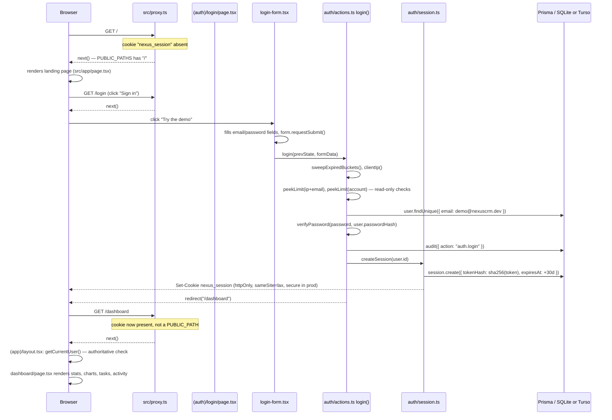
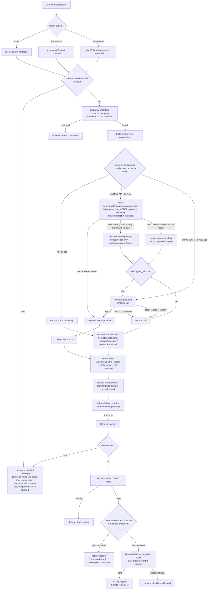
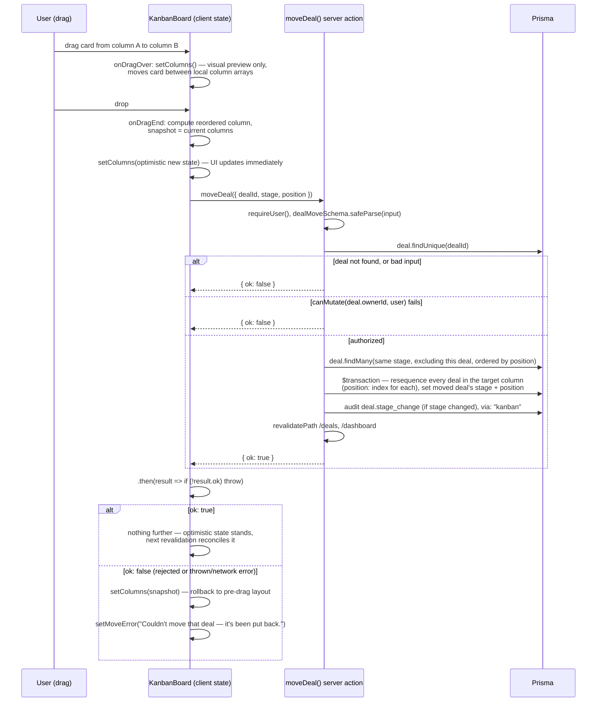

# User Flows

This traces the real request paths through Nexus CRM's routes, layouts and server actions —
what actually runs, in what order, and what a user sees on every branch, including failures. It
is written against the code on `fix/deployment-hardening` as it exists right now, not as a
description of intent. Every claim below cites the file it comes from.

Nexus CRM is single-tenant: one shared workspace, no `Workspace` model. Every `Company`,
`Contact`, `Deal`, `Task` and `Activity` row carries an `ownerId` (or `assigneeId`/`userId`)
pointing at a `User`, but there is no tenant boundary above that — every signed-in user, `ADMIN`
or `MEMBER`, sees every record. "Ownership" below means *who is allowed to edit or delete a
record*, not who can see it.

---

## 1. First-time visitor → demo login → dashboard

**Entry point:** `/` (unauthenticated)



- The landing page (`src/app/page.tsx`) is only reachable signed-out — `src/proxy.ts` redirects
  any request to `/`, `/login` or `/register` straight to `/dashboard` if the `nexus_session`
  cookie is merely *present*. That check never touches the database; it exists purely to avoid a
  flash of the marketing page for a signed-in visitor. The real gate runs later.
- The demo button is not a shortcut around auth. `LoginForm` (`src/app/(auth)/login/login-form.tsx`)
  fills the two fields with `demo@nexuscrm.dev` / `demo-password-123` and calls
  `form.requestSubmit()`, so it goes through the exact same `login()` server action, the same
  rate limiter, and the same audit log entry (`auth.login`) as a typed-in sign-in.
  The credentials are duplicated as a client-side constant in `login-form.tsx` rather than
  imported from `src/lib/demo-guard.ts`, because that module is server-only and importing it
  into a client component would pull server code into the browser bundle.
- After `createSession` sets the cookie, `login()` calls `redirect("/dashboard")`
  (`src/lib/auth/actions.ts`). The browser's next request hits `src/app/(app)/layout.tsx`, which
  calls `getCurrentUser()` again — this is the *authoritative* check, described in its own
  comment as distinct from the proxy's cookie-presence check. `getCurrentUser` is wrapped in
  React's `cache()` (`src/lib/auth/session.ts`) so every layout, page and action in one request
  shares a single session lookup instead of re-querying the database each time it's called.
- `/dashboard` (`src/app/(app)/dashboard/page.tsx`) then runs five queries in parallel
  (`Promise.all`): open deals, closed deals, new-contact count, the signed-in user's open tasks,
  and the eight most recent activities across the whole workspace. Stat tiles include a
  **weighted forecast** — `weightedValue()` in `src/lib/constants.ts` multiplies each open
  deal's value by a fixed `STAGE_PROBABILITY` (LEAD 0.1 … NEGOTIATION 0.75), a per-stage constant
  chosen deliberately over a per-deal override field that nothing has asked for.

---

## 2. Registration, and why the first account becomes ADMIN

**Entry point:** `/register`

1. `RegisterForm` (`src/app/(auth)/register/register-form.tsx`) posts name/email/password to
   `register()` in `src/lib/auth/actions.ts` via `useActionState`.
2. `register()` first calls `rateLimit(`register:${ip}`, { limit: 5, windowMs: 15 min })` — this
   one *does* consume budget on every call, unlike login's `peekLimit`, because there's no
   legitimate-success case to protect (nobody registers the same email repeatedly).
3. `registerSchema.safeParse` (`src/lib/validation.ts`) validates: name 2–100 chars, a real email
   (lowercased, max 254), password 8–128 chars. Failures return `{ errors }` rendered inline by
   `FieldError` — no round trip, no page reload.
4. `prisma.user.findUnique({ email })` checks for a collision → `"This email is already
   registered"` on the email field.
5. **The ADMIN rule:** `const userCount = await prisma.user.count(); role: userCount === 0 ?
   "ADMIN" : "MEMBER"`. This is a plain count of every user row at the instant of insert — there
   is no reserved "first ever" flag, so if the one existing ADMIN is ever deleted directly in the
   database, the *next* registrant becomes ADMIN again. In the normal lifecycle this only fires
   once, at initial setup: `prisma/seed-data.ts` creates exactly one account —
   `ensureDemoUser()` upserts `demo@nexuscrm.dev` with `role: "ADMIN"`, so the seeded admin and
   the seeded demo account are the same row. The only other account any script creates is
   `member@nexuscrm.dev`, via the separately-run `prisma/add-demo-member.ts`.
6. On success: `audit({ action: "auth.register" })`, `createSession(user.id)`, then
   `redirect("/dashboard")` — a new registrant lands signed in immediately, no email
   verification step exists.

Every new registrant — ADMIN or MEMBER — joins the *same* shared workspace and can immediately
see every existing company, contact and deal. There is no invite flow and no workspace creation
step; `/register` is just "create a login for this one shared CRM."

---

## 3. Sign in, sign out, session expiry

**Sign in** (`/login`, not demo): same `login()` path as §1, minus the auto-fill. Two independent
rate-limit buckets are checked with `peekLimit` (read-only — a bucket is only *charged* on an
actual failure, via `rateLimit`, a few lines later):

| Bucket | Key | Limit | Why two |
|---|---|---|---|
| IP | `login:{ip}:{email}` | 10 failures / 15 min | stops one source guessing many passwords |
| Account | `login:account:{email}` | 20 failures / 15 min | survives `x-forwarded-for` spoofing, which the IP bucket can't |

A non-existent email still runs `verifyPassword` against a hard-coded `DUMMY_HASH` bcrypt string
(`src/lib/auth/actions.ts`) so that a login attempt against an unregistered address takes the same
wall-clock time as one against a real account with a wrong password — the comment above it calls
this "constant-time-ish." Only *successful* logins skip charging both buckets — the comment notes
this deliberately, "otherwise the shared demo account lock[s] out its own visitors" (many people
signing in with the same demo password would otherwise trip the account bucket).

**Sign out:** `logout()` (`src/lib/auth/actions.ts`) audits `auth.logout` (only if a user was
actually found), calls `destroySession()` — deletes the `Session` row by its token hash and
clears the cookie — then `redirect("/login")`.

**Session mechanics** (`src/lib/auth/session.ts`):
- The cookie (`nexus_session`) holds a random 32-byte token. Only its SHA-256 hash is ever
  written to the `Session` table — a stolen database dump doesn't hand out usable session tokens.
- Sessions last 30 days from creation. The code *intends* sliding renewal — any request with
  fewer than 15 days left extends the `Session.expiresAt` row to +30 days from *now* — but
  **the renewal does not actually work**, and this is a known unfixed bug. `getCurrentUser()`
  ([`src/lib/auth/session.ts`](../src/lib/auth/session.ts)) updates only the database row; it
  never calls `cookies().set()`, and Next.js cannot write a cookie during a page render anyway.
  The browser therefore drops the cookie 30 days after sign-in no matter how active the user is.
  **The effective policy is a fixed 30-day absolute expiry**, and the extended row outlives its
  own cookie as unreachable garbage.
- **Expiry path:** `getCurrentUser()` compares `session.expiresAt < new Date()`. If expired, it
  deletes the row and returns `null` — the caller (`(app)/layout.tsx`) then `redirect("/login")`s.
  The stale cookie itself is *not* cleared on this path (only `destroySession()` on explicit
  logout clears it) — the browser still holds the old cookie, but the next request's
  `getCurrentUser()` finds no matching session row (already deleted) and redirects again, so the
  user just sees the login page rather than a broken state.
- `requireUser()` is the variant server actions call — it throws `"UNAUTHORIZED"` instead of
  returning `null`. Every server action in `src/server/actions/*` and `src/server/actions/ai.ts`
  starts with `const user = await requireUser()`.

---

## 4. Create and edit a contact

**Entry point:** `/contacts` → "New contact" button, or `/contacts/[id]` → "Edit"

Both open the same `ContactFormDialog` (`src/components/contact-form-dialog.tsx`); which server
action it's bound to depends on whether a `contact` prop was passed:

```ts
const boundAction = contact ? updateContact.bind(null, contact.id) : createContact;
```

- **Create:** `createContact()` (`src/server/actions/contacts.ts`) validates with
  `contactSchema` (`src/lib/validation.ts`), resolves `companyId` (if given, confirms the company
  still exists — a stale option in the form's `<select>` silently becomes "no company" rather
  than crashing on a dangling foreign key), sets `ownerId: user.id`, writes the row, audits
  `contact.create`, and revalidates `/contacts` + `/dashboard`.
- **Edit:** `updateContact(contactId, ...)` loads the existing row first and calls
  `canMutate(existing.ownerId, user)` (`src/lib/authz.ts`) — `ownerId === user.id || role ===
  "ADMIN"`. If that fails, it **returns** `{ message: NOT_YOURS }` rather than throwing. The
  comment explains why: this action runs inside a `useActionState` form, and throwing would trip
  the nearest error boundary (`(app)/error.tsx`) and discard everything the user had typed. A
  MEMBER editing someone else's contact instead sees "You can only edit records you own." inline
  in the dialog, form intact.
- Both branches: on success the dialog closes itself (`if (result.success) setOpen(false)` inside
  the wrapping action in `contact-form-dialog.tsx`) and the page re-renders with fresh server data
  via `revalidatePath`.
- **Delete** is a separate, stricter action: `deleteContact()` calls
  `assertNotLockedDemoAccount(user)` first (throws `DEMO_READONLY: …` if this is the shared demo
  account under `DEMO_MODE=true`), then the same `canMutate` check — but this one *throws*
  `"FORBIDDEN: only the owner or an admin can delete"` rather than returning a message, because
  delete is triggered from `DeleteButton` (`src/components/delete-button.tsx`), a plain
  `useTransition` call, not a form — the component catches the throw itself and shows "Only the
  owner or an admin can delete this."

Until this branch (`fix/deployment-hardening`), `canMutate` existed only on the five delete
actions; the four update actions had no ownership check at all, so any MEMBER could silently
rewrite any record. See `src/lib/authz.ts`'s own comment for that history.

---

## 5. The AI flow: score → summarize → draft → context → attach → send

**Entry point:** `/contacts/[id]` → "AI insights" card, rendered by `AiPanel`
(`src/components/ai-panel.tsx`), calling `src/server/actions/ai.ts`.



Branch-by-branch, in prose:

- **Rate limit (`aiRateLimited`, `src/server/actions/ai.ts`):** 30 AI calls per user per hour,
  shared across score/summarize/draft/send/file-extract — one bucket, `ai:{userId}`. Hitting it
  returns `{ ok: false, message: "AI rate limit reached — try again later." }`, rendered by
  `AiPanel` in a warning-styled paragraph; no partial UI state changes.
- **Provider selection (`src/lib/ai/provider.ts`):** `generateText()` tries Gemini if
  `GEMINI_API_KEY` is set, else Groq if `GROQ_API_KEY` is set, else returns `null` synchronously
  — there is no fail-over between the two if one is configured and fails; whichever key exists is
  the only provider tried. Every provider call has a **30-second `AbortSignal.timeout`**.
- **Timeout / network failure branch:** if `fetch` itself rejects (DNS failure, timeout,
  connection reset — as opposed to a valid HTTP error response), the `try/catch` in
  `generateText()` catches it, reports to Sentry with `tags: { subsystem: "ai-provider" }`, logs
  to console, and returns `null` — which every caller (`scoreContact`, `summarizeContact`,
  `draftFollowUp`) treats identically to "no key configured": fall back to the heuristic. Before
  this branch existed (per its comment), that rejection would have escaped into the error
  boundary and blanked the page instead.
- **Heuristic fallback (`src/lib/ai/heuristics.ts`):** deterministic, no network call — computes a
  score from signals like status, has-email, has-phone, open deal count/value, days since last
  activity; a canned-but-parameterized summary and email draft. `AiPanel` labels this
  "rule-based fallback (AI provider unavailable)" rather than showing the raw string `"heuristic"`.
- **Score is persisted** (`prisma.contact.update({ data: { aiScore, aiScoreReason, aiScoredAt }
  })`); summarize and draft are **not** — they render once in the panel and vanish on navigation.
- **Add context / attach a file:** the "+ Add context for the draft" toggle reveals a textarea
  (capped client-side to 2000 chars, matching `aiContextSchema`'s server-side max) and a file
  picker accepting `.pdf/.txt/.md`. Picking a file calls `extractFileText()` immediately, which
  charges the *same* shared `ai:{userId}` bucket as every other AI action — there is one 30/hour
  budget across all five, not one each — via `validateUpload()`
  (`src/lib/file-context.ts`): rejects non-PDF/txt/md, files over 5 MB, and empty files. A PDF is
  parsed with `unpdf` (chosen over `pdf-parse` because it targets serverless runtimes rather than
  assuming a filesystem); a scanned/image-only PDF yields no extractable text and returns "a
  scanned PDF needs OCR, which isn't supported." Extracted text is truncated to 20,000 characters
  (`MAX_CONTEXT_CHARS`) — and **truncated again server-side inside `draftFollowUp`** even though
  the client already truncated it, because the client sends the text back on the next call and a
  cap that only exists client-side is not a cap. The file itself is never written to disk or
  database — parsed once, used once, dropped; the panel's own copy tells the user "sent to the AI
  provider" so that's not silent.
- **Send to yourself:** deliberately never sends to the contact — `sendFollowUp()`'s own comment
  explains why: the demo is publicly linked with published credentials, so a "send to anyone"
  button would turn it into a spam relay. The recipient is hard-coded to `user.email` regardless
  of what's in the draft.
  - **Simulated branch:** triggers if `isLockedDemoAccount(user)` (the shared demo account under
    `DEMO_MODE=true`) **or** `!emailConfigured()` (no `RESEND_API_KEY`/`EMAIL_FROM` set — the
    default in local dev). No network call is made; an `Activity` is still logged with
    `[simulated send]` prefixed to the subject/body, "so the flow is visible in the demo even when
    nothing is actually sent" (comment). The user-facing message differs by reason: demo account
    → "the shared demo does not deliver real email"; missing config → "Set RESEND_API_KEY and
    EMAIL_FROM to deliver for real."
  - **Real send branch:** calls Resend's REST API (`src/lib/email.ts`, plain `fetch`, no SDK —
    matching how `provider.ts` talks to Gemini/Groq). On a non-2xx response, `sendEmail` returns
    `{ sent: false, detail }` with up to 200 chars of Resend's response body (e.g. "only your own
    verified address" on Resend's free tier), and `sendFollowUp` returns `ok: false` with that
    detail — the Activity is **not** logged in this failure case, only on success or simulation.

---

## 6. Kanban drag-and-drop: optimistic update and rollback

**Entry point:** `/deals` → `KanbanBoard` (`src/components/kanban/board.tsx`), backed by
`dnd-kit`.



- **Two-phase optimism:** `onDragOver` moves the card between columns purely as a *visual*
  preview while the pointer is still down — no snapshot, no server call. `onDragEnd` is where the
  real optimistic update happens: it snapshots the pre-drop `columns` state, applies the final
  reordering locally, and *then* fires `moveDeal()`.
- **Server-side authorization the client can't see:** `moveDeal()` checks `canMutate(deal.ownerId,
  user)` exactly like the update actions — a MEMBER dragging a card they don't own gets `{ ok:
  false }` with no message field, just a boolean. The board's `.catch()`/`!result.ok` handling
  treats "rejected because not yours" identically to "rejected because the network call failed" —
  both roll back to `snapshot` and show the generic message "Couldn't move that deal — it's been
  put back." A MEMBER who successfully drags their *own* card between columns never sees this.
- **Resequencing, not just moving:** `moveDeal` doesn't just set the dragged deal's `stage` and
  `position` — it rebuilds the *entire target column's* order in one `$transaction`
  (`prisma/schema.prisma`'s `Deal.position` field), setting every deal's position to its array
  index. This keeps `position` dense and gap-free after every move, at the cost of writing every
  card in the column on every single drag — this is called out as a known race in the
  known-open-items list: two people moving cards into the same column concurrently can produce
  duplicate or skipped positions, since the read-then-write isn't isolated by a lock.
  `closedAt` is set to "now" the first time a deal lands in `WON`/`LOST` (and left alone on
  subsequent moves within those stages, via `deal.closedAt ?? new Date()`).
- **Reconciliation after a real page revalidation:** `KanbanBoard` re-derives `columns` from the
  `deals` prop whenever it changes identity (`if (lastDeals !== deals)`), which happens after
  `revalidatePath("/deals")` re-renders the server component with fresh data — this is what makes
  the optimistic state eventually consistent with the database even without a per-move refetch.
- Clicking a card (rather than dragging it), or pressing Enter on a focused one, navigates to
  `/deals/[id]` via `router.push` — the deal's own page, with its details, tasks, composer and
  timeline. Editing lives there: `DealEditButton` opens `DealFormDialog` pre-filled, which goes
  through `updateDeal()` (§4's pattern: `canMutate` check, returns `{ message: NOT_YOURS }` on
  rejection rather than throwing, since it's a form). The board keeps only the "New deal" dialog.
  A link nested inside the draggable card was rejected because an interactive element inside a
  `role="button"` trips axe's nested-interactive rule, and the accessibility suite runs on `/deals`.

---

## 7. Tasks: create, toggle, delete

Tasks appear in three places: the dashboard's "My tasks" card, a contact's "Open tasks" card, and
inline wherever `QuickTaskForm` is mounted (`src/components/quick-task-form.tsx`).

- **Create:** `createTask()` (`src/server/actions/tasks.ts`) validates with `taskSchema`, then
  calls `findMissingRelation({ contactId, dealId })` (`src/lib/relations.ts`), guarding against a
  stale `<select>` option (a contact deleted in another tab, say) reaching Prisma as a dangling
  foreign key; a missing relation returns a message instead of a Prisma constraint error.
  Note the layer is **not** consistent here: `createDeal` and `createContact` use
  `resolveRelation()` / `resolveCompanyId()` instead, which silently coerce a missing relation to
  `null` and report nothing. Only `createTask` and `createActivity` return the message. Two
  policies for one problem — tracked as a cleanup. `assigneeId` is
  always `user.id` — there is no "assign to someone else" control anywhere in the UI.
- **Toggle done/open:** `toggleTask(taskId)` — no form, called directly from the checkbox in
  `TaskList` (`src/components/task-list.tsx`) inside a `useTransition`. Loads the task,
  `canMutate(task.assigneeId, user)`, flips `done`, audits `task.complete` or `task.reopen`
  depending on the *previous* state. A MEMBER trying to toggle someone else's task gets the thrown
  `FORBIDDEN`, caught by `TaskList`'s own `try/catch`, shown as "Couldn't update that task — it
  may be assigned to someone else."
- **Delete:** same `assertNotLockedDemoAccount` + `canMutate` pattern as every other delete action;
  same catch-and-message in `TaskList`.
- **Overdue styling** is computed client-side in `TaskList`: `!task.done &&
  isOverdueDateOnly(task.dueDate)`. `dueDate` is stored as a date-only value at UTC midnight, and
  the helper (`src/lib/utils.ts`) returns `false` for a null date and otherwise compares whole UTC
  days rather than the raw instant. The earlier
  `new Date(task.dueDate) < new Date()` comparison marked a task due "today" as overdue up to a
  day early in negative UTC offsets, because midnight UTC for that date had passed locally before
  the user's own midnight — fixed, with a test that walks every hour of the due date.
- All three actions call `revalidateFor(task)`, which revalidates `/dashboard` always, plus
  `/contacts/{contactId}` and `/deals` only if the task actually has that relation — so a
  dashboard-only quick task never triggers a wasted revalidation of `/deals`.

---

## 8. Company and contact detail pages

Both `/contacts/[id]` and `/companies/[id]` (`src/app/(app)/contacts/[id]/page.tsx`,
`src/app/(app)/companies/[id]/page.tsx`) are server components that `notFound()` if the row
doesn't exist (any signed-in user can view any record — `findUnique` has no `ownerId` filter,
consistent with the shared-workspace design).

- **Contact detail** loads the contact plus: company, owner name, up to 5 open tasks (ordered by
  due date), and the 20 most recent activities (with the acting user, and the related
  contact/deal names for cross-links). It renders `AiPanel` (§5), `TaskList` +
  `QuickTaskForm`, `ActivityComposer`, an inline deals list, and `ActivityFeed` for the timeline.
- **Company detail** loads contacts (all, ordered by `updatedAt`), deals (all), and 15 recent
  activities, plus three stat cards: open pipeline value (deals not in `WON`/`LOST`), contact
  count, deal count. No AI panel exists on companies — AI is contact-scoped only, since every
  `recordBlock()` prompt in `src/server/actions/ai.ts` is built from a single contact plus its
  related deals/activities.
- Both pages compute `demoLocked = isLockedDemoAccount(currentUser)` once, server-side, and pass a
  `disabledReason` string into `DeleteButton` when true — so a demo-account visitor sees the
  delete dialog with "Deleting is turned off in the shared demo…" and the confirm button disabled,
  rather than clicking delete and getting a thrown error.
- Deleting a contact or company redirects back to its list page (`redirect("/contacts")` /
  `redirect("/companies")`) after the DB delete and audit write — there is no "undo."

---

## 9. Permission denials a MEMBER hits

| Action | Where | What's checked | On failure |
|---|---|---|---|
| Edit someone else's contact/company/deal | `updateContact`/`updateCompany`/`updateDeal` | `canMutate(ownerId, user)` | Returns `{ message: NOT_YOURS }` ("You can only edit records you own."), form data preserved |
| Delete someone else's record | `deleteContact`/`deleteCompany`/`deleteDeal`/`deleteTask` | `canMutate` | Throws `FORBIDDEN: …`; caught by `DeleteButton`/`TaskList`, shown as a friendly inline message |
| Drag someone else's deal card | `moveDeal` | `canMutate(deal.ownerId, user)` | `{ ok: false }`; board rolls back the drag, shows "Couldn't move that deal — it's been put back." |
| Toggle/complete someone else's task | `toggleTask` | `canMutate(task.assigneeId, user)` | Throws `FORBIDDEN: …`; `TaskList` shows "Couldn't update that task — it may be assigned to someone else." |
| View another user's email on `/settings` | `SettingsPage` | `isAdmin \|\| m.id === user.id` per roster row | That member's `email` field is `null` in the rendered roster — name and role still show, so team context isn't hidden, just the PII |
| Delete anything while signed in as the shared demo account | any `delete*` action | `assertNotLockedDemoAccount(user)` (only when `DEMO_MODE=true`) | Throws `DEMO_READONLY: …`; UI pre-empts this with a disabled confirm button and explanation, so the throw is a defense-in-depth backstop, not the normal path |

An ADMIN bypasses every `canMutate` check (`ownerId === user.id || role === "ADMIN"`) and can edit
or delete anything regardless of owner — but is *not* exempt from the demo-account lock, since
that check is independent of role.

---

## 10. Error and empty states

- **Thrown error in a Server Component / layout under `(app)`:** caught by
  `src/app/(app)/error.tsx` — a client component with `unstable_retry()`, shows "Something went
  wrong. This page failed to load. Retrying usually fixes it." plus the Next.js error `digest`
  (a correlation id, not the raw error — nothing sensitive is exposed to the browser).
- **404** (`notFound()` from a detail page whose `id` doesn't resolve, or any unmatched route):
  `src/app/(app)/not-found.tsx` — "That record may have been deleted, or the link is out of
  date," with a link back to `/dashboard`.
  - Below the `(app)` layout there's also a root-level `src/app/global-error.tsx` and
    `src/app/not-found.tsx`, which only render if the error occurs *above* where `(app)/error.tsx`
    can catch it (e.g. in the root layout itself).
- **Empty states** are a dedicated `EmptyState` component (`src/components/ui/empty-state.tsx`)
  used consistently: no companies yet vs. no search matches (different copy for each, computed in
  `subtitle()`/the `title` ternary in `src/app/(app)/companies/page.tsx`), no deals on a contact,
  no activity yet, no open tasks ("All clear").
- **Form-level errors** never navigate away or throw to a boundary — every create/update action
  returns `{ errors }` (per-field, from `fieldErrors(zodError)`) or `{ message }` (whole-form,
  e.g. `NOT_YOURS` or "Contact not found"), rendered inline by the same dialog that submitted.
  This is a deliberate pattern across every `*FormDialog` component: authorization and validation
  failures are data returned from the action, not exceptions — reserving thrown errors for the
  handful of non-form triggers (`DeleteButton`, `TaskList`'s toggle/delete, `moveDeal`'s
  Promise rejection path) that already wrap their call in try/catch by necessity.

---

## 11. The nightly demo reset

**Not a route.** The landing page invites anyone to sign into the shared demo account, and
`DEMO_MODE` only blocks *deletion* — it does nothing to stop a visitor from creating new
companies, contacts, deals or tasks, or editing existing ones. Left alone, the shared workspace
would accumulate junk and drift from its seeded state indefinitely.

`.github/workflows/reset-demo.yml` runs on a nightly cron (`0 19 * * *` = 03:00 Manila time) plus
`workflow_dispatch` for a manual run, and executes `npm run demo:reset` →
`scripts/reset-demo.ts` against the production Turso database using secrets scoped to that one
workflow step. The workflow deliberately has **no corresponding application route** — the
design doc (`docs/superpowers/specs/2026-08-01-demo-reset-design.md`) and the workflow's own
comment explain why: a URL whose job is to erase the database is a URL worth not publishing at
all, versus a scheduled job with credentials that exist only inside GitHub Actions.

**What actually gets deleted is broader than "the demo account's data":**
`scripts/reset-demo.ts` deletes **every** `Activity`, `Task`, `Deal`, `Contact` and `Company` row
in the target database, in FK-safe order — not filtered by owner. Because Nexus CRM is
single-tenant with one shared workspace, this means a real registered user's own contacts and
deals, created in the same production database the demo uses, are wiped by the same nightly job.
`User` and `Session` rows are explicitly left alone (`ensureDemoUser` re-creates/finds the demo
login; nothing else touches `User`), so accounts survive, but none of their CRM data does. This is
consistent with the project's explicit shared-workspace design (there's no tenant boundary to
reset *around*), but is worth stating plainly: **anyone who registers a real account on the public
deployment and stores real data in it will lose that data at the next nightly reset.** The
`AuditLog` table is pruned rather than wiped — see `auditPruneWhere()` in
`src/lib/reset-guard.ts`, which builds the `WHERE` clause for `auditLog.deleteMany()`. It
**deletes** entries authored by the demo user (they describe records this reset is about to
delete anyway) and anything older than 30 days; everything else — a real user's recent
login and change history — **survives**.

From a signed-in demo user's point of view: nothing happens *to* an active session — sign-ins
aren't revoked. At 03:00 Manila time the next day, the workspace they were editing has silently
reverted to the seeded baseline (`prisma/seed-data.ts`'s `seedDemoData`) — companies, contacts and
deals they created overnight are gone, replaced by the same fixed seed set everyone starts from.

The reset script refuses to run against a real database unless `ALLOW_REMOTE_DB=true` is set
(`resolveResetTarget()` in `src/lib/reset-guard.ts`) — a local `npm run demo:reset` targets the
local SQLite file by default, and even with the flag set, it throws rather than guessing if
`TURSO_DATABASE_URL` is absent. It also refuses to report success if the reset would leave zero
`User` rows (`if (after.users === 0) throw …`) — a defensive check against a bug that would
otherwise lock everyone, including the demo account, out of the app entirely.

---

## Reference: files behind these flows

| Concern | File(s) |
|---|---|
| Auth gate (cookie presence only) | `src/proxy.ts` |
| Authoritative auth check | `src/lib/auth/session.ts` (`getCurrentUser`, `requireUser`) |
| Login/register/logout | `src/lib/auth/actions.ts` |
| Ownership rule | `src/lib/authz.ts` |
| Demo account lock | `src/lib/demo-guard.ts` |
| AI actions | `src/server/actions/ai.ts` |
| AI provider + fallback | `src/lib/ai/provider.ts`, `src/lib/ai/heuristics.ts` |
| File upload for AI context | `src/lib/file-context.ts` |
| Email send | `src/lib/email.ts` |
| Kanban board (client) | `src/components/kanban/board.tsx` |
| Deal move/update/delete | `src/server/actions/deals.ts` |
| Contact/Company/Task actions | `src/server/actions/{contacts,companies,tasks}.ts` |
| Validation schemas | `src/lib/validation.ts` |
| Stage probability / forecast | `src/lib/constants.ts` |
| Rate limiting | `src/lib/rate-limit.ts` |
| Audit logging | `src/lib/audit.ts` |
| Demo reset | `.github/workflows/reset-demo.yml`, `scripts/reset-demo.ts`, `src/lib/reset-guard.ts` |
